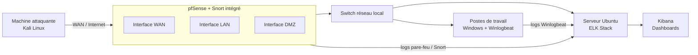

# NGIPS - Mise en place d'un NGIPS
# 🛡️ NGIPS — pfSense + Snort + ELK Stack

Solution de prévention d'intrusion de nouvelle génération (NGIPS), déployée en environnement virtuel (GNS3 / VMware). Elle combine **pfSense** et **Snort** pour le filtrage, la détection et le blocage actif des menaces, associés à la **suite ELK** pour la centralisation et la visualisation des journaux de sécurité.

---

## 📋 Sommaire

- [Architecture](#-architecture)
- [Stack technique](#-stack-technique)
- [Environnement de test](#-environnement-de-test)
- [Installation et configuration](#-installation-et-configuration)
- [Tests d'intrusion réalisés](#-tests-dintrusion-réalisés)
- [Résultats](#-résultats)
- [Perspectives techniques](#-perspectives-techniques)

---

## 🏗️ Architecture

Contrairement à une architecture classique où l'IPS est un équipement séparé placé après le pare-feu, la solution retenue **intègre nativement Snort au sein de pfSense**. Un seul équipement assure donc à la fois le filtrage (pare-feu) et l'inspection/blocage (IPS), ce qui réduit le coût et la complexité de gestion.



- **pfSense + Snort** : filtrage réseau, détection et blocage automatique des menaces (mode IPS via l'option *Block Offenders*), sur trois interfaces (WAN, LAN, DMZ).
- **Suite ELK** (Elasticsearch, Logstash, Kibana) : collecte, indexation et visualisation centralisée des journaux.
- **Winlogbeat** : agent installé sur les postes Windows pour transmettre les journaux d'événements (connexions, échecs d'authentification, comptes bloqués…) vers ELK.

## 🧰 Stack technique

| Composant | Rôle |
|---|---|
| **pfSense** | Pare-feu / passerelle réseau |
| **Snort** | IPS/IDS — détection et blocage des intrusions |
| **Elasticsearch** | Stockage et indexation des logs |
| **Logstash** | Collecte et transformation des logs |
| **Kibana** | Visualisation / dashboards |
| **Winlogbeat** | Agent de collecte des logs Windows |
| **GNS3** | Simulation de la topologie réseau |
| **VMware Workstation** | Virtualisation des machines |
| **Nmap** | Test — scan de ports |
| **hping3** | Test — déni de service (SYN flood) |
| **Hydra** | Test — force brute SSH |

## 🖥️ Environnement de test

| VM | Rôle | RAM | CPU | Stockage | OS |
|---|---|---|---|---|---|
| **VM1** | Serveur ELK (supervision) | 4 Go | 2 | 50 Go | Ubuntu Server (64 bits) |
| **VM2** | Machine cliente supervisée | 4 Go | 4 | 30 Go | Windows 10 (64 bits) |
| **VM3** | Machine attaquante (tests) | 2 Go | 2 | 40 Go | Kali Linux (64 bits) |

## ⚙️ Installation et configuration

### 1. pfSense — pare-feu + IPS
1. Création des réseaux virtuels (interface WAN via NAT, LAN, puis DMZ).
2. Installation de pfSense et attribution des interfaces réseau.
3. Vérification de la connectivité Internet (`ping 8.8.8.8` via l'option **7 — Ping host** du menu console).
4. Connexion à l'interface web de pfSense et changement des identifiants par défaut (`admin` / `pfsense`).

### 2. Snort — activé comme IPS intégré à pfSense
1. `Système > Gestionnaire de paquets > Paquets disponibles`, rechercher **snort**, cliquer sur **+ Install**.
2. Configuration des **Global Settings** :
   - Activation des règles **Snort GPLv2 Community** (gratuites, couverture de base).
   - Activation des règles **ET Open** (Emerging Threats — signatures de menaces récentes/émergentes).
3. Ajout de Snort sur chaque interface (`Services > Snort > Snort Interfaces > Add`) : WAN, LAN puis DMZ, avec activation des catégories de règles souhaitées (*WAN categories*, etc.).
4. Activation de l'option **Block Offenders** sur chaque interface : c'est ce paramètre qui fait passer Snort du mode IDS (détection passive) au mode **IPS** (blocage actif automatique).

### 3. Suite ELK (sur le serveur Ubuntu)

```bash
# Prérequis
apt update && apt-get install apt-transport-https gnupg curl wget

# Clé et dépôt Elastic
wget -qO - https://artifacts.elastic.co/GPG-KEY-elasticsearch | gpg --dearmor -o /usr/share/keyrings/elasticsearch-keyring.gpg
echo "deb [signed-by=/usr/share/keyrings/elasticsearch-keyring.gpg] https://artifacts.elastic.co/packages/8.x/apt stable main" | tee /etc/apt/sources.list.d/elastic-8.x.list

# Installation
apt update && apt-get install elasticsearch
apt update && apt-get install kibana

# Configuration de l'adresse d'écoute
# /etc/elasticsearch/elasticsearch.yml
network.host: <IP_DU_SERVEUR>

# /etc/kibana/kibana.yml
server.host: "0.0.0.0"
server.publicBaseUrl: "http://<IP_DU_SERVEUR>:5601"

# Démarrage des services
systemctl start elasticsearch.service
systemctl start kibana.service
```

NB: Consultez les versions officielles de la suite ELK, les versions changent régulièrement. 

Kibana devient accessible via HTTPS à l'adresse `https://<IP_DU_SERVEUR>:5601`.

### 4. Winlogbeat (sur les postes Windows)
1. Télécharger Winlogbeat depuis le site officiel Elastic (`elastic.co/downloads/beats/winlogbeat`).
2. Éditer `winlogbeat.yml` en renseignant l'adresse IP du serveur ELK comme sortie (output).
3. Démarrer le service Winlogbeat.
4. Vérifier la communication avec ELK via la commande de test intégrée (`winlogbeat test output`).

## 🧪 Tests d'intrusion réalisés

Toutes les attaques ont été lancées depuis la machine Kali Linux (VM3, positionnée côté WAN) vers les cibles du réseau, avec Snort configuré en mode blocage actif (*Block Offenders*).

| # | Attaque | Commande / outil | Résultat |
|---|---|---|---|
| 1 | Scan de ports | `nmap <IP_cible>` | Détectée (alerte *SCAN Suspicious…*) puis **bloquée** — IP source visible dans l'onglet *Alerts* puis *Blocked* de Snort |
| 2 | Déni de service — SYN flood | `hping3` avec paquets SYN sur le port 22, IP sources aléatoires | Détectée et **bloquée** |
| 3 | Force brute SSH | `hydra` + dictionnaire `rockyou.txt.gz`, utilisateur ciblé | Détectée et **bloquée** — l'attaquant reçoit l'erreur *"No route to host"* |
| 4 | Authentification illégitime (Windows) | Connexion avec mot de passe volontairement erroné | **Détectée et journalisée** via Winlogbeat, visible dans le dashboard Kibana (`event.action` → *Failed Logons*) |

## 📊 Résultats

- Snort surveille activement le trafic entrant/sortant sur les trois interfaces (WAN, LAN, DMZ).
- Les trois attaques réseau testées (scan, DoS, brute force) ont été **détectées puis bloquées automatiquement**, confirmant le fonctionnement en mode IPS (et non simple IDS passif).
- Les tentatives de connexion échouées sur les postes Windows sont remontées en temps réel dans Kibana via Winlogbeat, avec horodatage et nom d'utilisateur concerné.
- Les journaux du pare-feu et des postes clients sont centralisés dans une seule interface de supervision (Kibana).

> 💡 Ajoutez ici vos captures d'écran (dashboards Kibana, alertes Snort, etc.), par exemple dans un dossier `docs/screenshots/`.

## 📈 Perspectives techniques

- Intégration d'un **VPN site à site** pour sécuriser les communications entre sites distants.
- Ajout de règles de corrélation supplémentaires dans ELK pour affiner la détection et réduire les faux positifs.
- Automatisation du déploiement (scripts d'installation / Infrastructure as Code).
